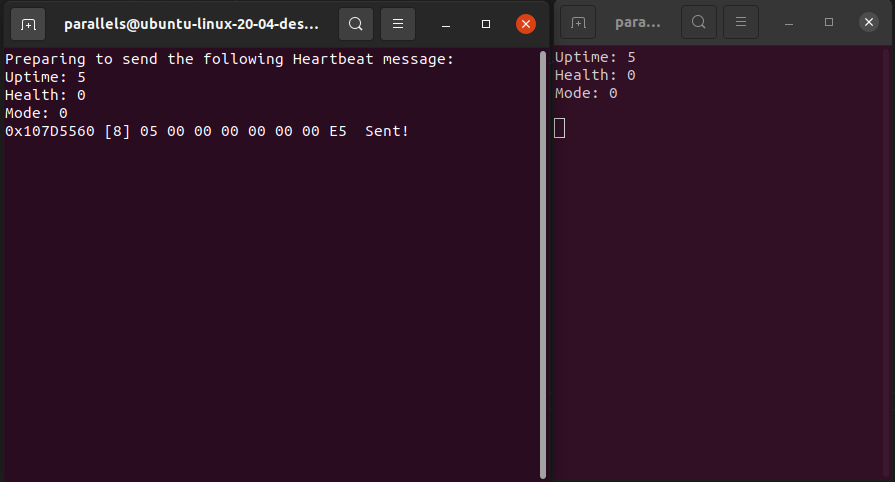

# socketcan_canard

## Overview

This repo is based off of Abraham Rodriguez's (abraham_rodriguez@nxp.com) libcanard_S32K1 example. You can find his code here: https://github.com/noxuz/libcanard_S32K1/

Socketcan_canard is a basic implementation of Libcanard in Linux using a virtual CAN bus (vcan0) with SocketCAN. The source code contains two main source files: test_canard_tx.c and test_canard_rx.c. The tx file packages a Heartbeat_1_0 message and sends it over the virtual CAN bus. The rx file receives this file and prints out the Heartbeat_1_0 information.



## Prerequisities

You'll want to be running a Linux distribution with SocketCAN support, which is pretty much any Linux distro these days.

Clone the repo by running:

```$ git clone https://github.com/landonh12/socketcan_canard```

## Setup

First, you'll want to set up the vcan0 SocketCAN bus. You can do so by running the start_vcan.sh script in the scripts/ directory:

```$ ./scripts/start_vcan.sh```

Next you'll want to build the binaries for the RX and TX nodes. You can do so by running `make`. The binaries will be stored in the `bin/` directory within the root of the project.

## Running the project

To run the project, open up two separate terminals on your Linux machine and run the TX and RX nodes in each:

Term 1:
```$ ./bin/test_canard_tx```

Term 2:
```$ ./bin/test_canard_rx```

The TX node will print the RAW can frame sent over the `vcan0` bus, while the RX node will print Uptime, Health, and Mode fields. The Health and Mode fields should stay 0 while the uptime increments by 1 every second.

# Code Walkthrough

## TX node
The TX node shows users how to create a Heartbeat_1_0 message, package it into a CanardTransfer, push it onto the CanardInstance transfer stack, convert the CanardFrame to a SocketCAN frame, and send it over the bus. Below is a walkthrough of each section of code to give a deeper understanding.

### Includes

```
// UAVCAN specific includes
#include <uavcan/node/Heartbeat_1_0.h>
#include <libcanard/canard.h>
#include <o1heap/o1heap.h>

// Linux specific includes
#include <time.h>
#include <stdio.h>
#include <stdlib.h>
#include <string.h>
#include <unistd.h>
#include <stdint.h>
#include <net/if.h>
#include <sys/ioctl.h>
#include <sys/socket.h>
#include <linux/can.h>
#include <linux/can/raw.h>
#include <pthread.h>
```
We include just three UAVCAN specific headers within the example TX node. The first one, `<uavcan/node/Heartbeat_1_0.h>` is the header for the base UAVCAN heartbeat message that is required for all UAVCAN nodes. The header contains data structures and functions for populating a Heartbeat_1_0 message, serializing and deserializing it, and more. 

As for Linux specific includes, we have many of the standard C libraries as well as SocketCAN specific headers such as `linux/can.h` and `linux/can/raw.h`. Since we implement the TX node as a multi-threaded application, `pthread.h` is included as well. More info on that later in this walkthrough.

## Global vars and function prototypes

```
// Function prototypes
void *process_canard_TX_stack(void* arg);
static void* memAllocate(CanardInstance* const ins, const size_t amount);
static void memFree(CanardInstance* const ins, void* const pointer);
int open_vcan_socket(void);
```

For our function prototypes we have one for processing the CanardInstance transfer stack, one for opening a SocketCAN (vcan0) socket, and two for memory management through o1heap. The memory management functions are taken from the o1heap documentation [here.](https://github.com/pavel-kirienko/o1heap)

```
// Create an o1heap and Canard instance
O1HeapInstance* my_allocator;
volatile CanardInstance ins;

// Transfer ID
static uint8_t my_message_transfer_id = 0;

// Uptime counter for heartbeat message
uint32_t test_uptimeSec = 0;

// Buffer for serialization of a heartbeat message
size_t hbeat_ser_buf_size = uavcan_node_Heartbeat_1_0_EXTENT_BYTES_;
uint8_t hbeat_ser_buf[uavcan_node_Heartbeat_1_0_EXTENT_BYTES_];

// vcan0 socket descriptor
int s;
int open_vcan_socket(void);
```

The rest of the code here before the main function is just global variables for use within each thread. We instantiate an O1HeapInstance for memory allocation, global vars for message transfer ID, an uptime counter, a heartbeat serialization buffer, and a SocketCAN descriptor for our vcan0 bus.

## Setup within main()

```
int main(void)
{
	// Allocate 4KB of memory for o1heap.
    void *mem_space = malloc(4096);
    
    // Initialize o1heap
    my_allocator = o1heapInit(mem_space, (size_t)4096, NULL, NULL);
    
    printf("Address for s (main): %ls\n", &s);
    int sock_ret = open_vcan_socket();

    // Make sure our socket opens successfully.
    if(sock_ret < 0)
    {
        perror("Socket open");
        return -1;
    }
    
    // Initialize canard as CANFD and node no. 96
    ins = canardInit(&memAllocate, &memFree);
    ins.mtu_bytes = CANARD_MTU_CAN_FD;
    ins.node_id = 96;

    // Initialize thread for processing TX queue
    pthread_t thread_id;
    int exit_thread = 0;
    pthread_create(&thread_id, NULL, &process_canard_TX_stack, (void*)&exit_thread);
```

Within main(), we need to do some setup before actually sending UAVCAN messages. 

First, we need to allocate memory using o1heap for our `CanardInstance`. To do this, we allocate 4KB of memory (a typical amount of memory you'll find on a resource-constrained system like a Cortex-M0 microcontroller) by using `malloc()`. We store a pointer to this memory in a `void*` called mem_space. Then, we call `o1heapInit()` and pass `mem_space`, the size of our allocated memory block as a `size_t` (in this case, 4096), and NULL for the last two parameters. The last two parameters are `critical_section_enter` and `critical_section_leave` of type `O1HeapHook`. We don't need to worry about those arguments for this simple application.

Second, we open our `vcan0` socket using `open_vcan_socket()`. The contents of this function are a basic example of opening a socket with SocketCAN, and you can find more info from this webpage: https://www.beyondlogic.org/example-c-socketcan-code/

Third, we need to initialize our CanardInstance by running calling `canardInit()` and passing our `memAllocate` and `memFree` functions. These functions are example functions provided in the o1heap documentation. We then pass data to the `.mtu_bytes` and `node_id` fields of our `CanardInstance`. In this case, we specify we are using CAN-FD and that our node id will be 96. We chose 96 as an arbitrary number because we will be broadcasting our Heartbeat_1_0 message to all nodes (in this case, we have only one other node in the system). More on that later in this walkthrough.

Finally, we create a new thread for our `process_canard_TX_stack` function to run in the background. This allows the `CanardInstance` transfer stack to send raw CAN messages without blocking our main function, which would cause a delay in transfer, resulting in our RX node receiving messages late. This thread is spawned using a `pthread` which stands for "POSIX thread". You can learn about POSIX threads [here](https://www.cs.cmu.edu/afs/cs/academic/class/15492-f07/www/pthreads.html).

### Copyright© 2021, NXP. All rights reserved.
